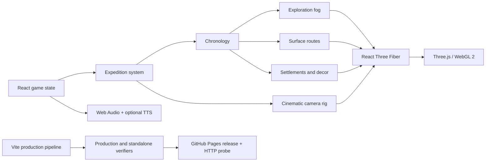

<div align="center">

# ᚠ VIKING CHRONOLOGY ᚱ

### Историческая 3D-игра об экспедициях северян · 750–1021

**Фьорд и поселение · подготовка команды · три исторические главы · кинематографическая камера · русские субтитры · доказательная хронология**

</div>

<p align="center">
  <a href="https://github.com/IvanChernykh/viking-chronology/actions/workflows/ci.yml">
    
  </a>
  <a href="https://github.com/IvanChernykh/viking-chronology/actions/workflows/pages.yml">
    
  </a>
  <a href="#локальный-запуск">
    
  </a>
</p>

<p align="center">
  
  
  
  
  
  
</p>

> [!IMPORTANT]
> Публичная ссылка появится в этом README только после того, как release workflow сам получит от сайта HTTP 200 и найдёт сигнатуру приложения. Наличие YAML-файла или успешной сборки больше не считается доказательством работающего Pages.

---

<table>
<tr>
<td align="center" width="20%"><strong>3</strong><br/><sub>экспедиционные главы</sub></td>
<td align="center" width="20%"><strong>19</strong><br/><sub>исторических локаций</sub></td>
<td align="center" width="20%"><strong>3</strong><br/><sub>члена команды</sub></td>
<td align="center" width="20%"><strong>750–1021</strong><br/><sub>хронология</sub></td>
<td align="center" width="20%"><strong>3</strong><br/><sub>GPU-профиля</sub></td>
</tr>
</table>

## Версия 3.0: Expedition vertical slice

Viking Chronology больше не является интерактивным глобусом. Игрок начинает в скандинавском поселении, выбирает историческую главу, разговаривает с командой, комплектует корабль и запускает экспедицию. Камера следует за судном по поверхности воды, а хронология и неизвестные территории раскрываются вместе с путешествием.

<table>
<tr>
<td width="33%" valign="top">

### 1. Совет экспедиции

- выбор одной из трёх глав;
- историческая цель и границы реконструкции;
- размер команды и уровень риска;
- требования к провизии, древесине и парусине;
- обязательные разговоры минимум с двумя членами команды.

</td>
<td width="33%" valign="top">

### 2. Выход из фьорда

- детализированный процедурный длинный корабль;
- наземно-морская `CatmullRomCurve3` без воздушных дуг;
- плавная ориентация корпуса и анимация паруса;
- постановочная боковая камера;
- прогресс путешествия и синхронная хронология.

</td>
<td width="33%" valign="top">

### 3. Исторический результат

- открытие доступных территорий и поселений;
- карточки дат, свидетельств и уверенности;
- русские субтитры для реплик;
- маркировка реконструированного материала;
- возврат в поселение и выбор следующей главы.

</td>
</tr>
</table>

## Три главы

| Глава | Период | Игровая рамка | Риск |
|---|---:|---|---|
| **Западный берег** | 793–866 | Скандинавия → Британские острова | высокий |
| **Речной путь** | 860–907 | Балтика → речные системы Восточной Европы | умеренный |
| **Северная Атлантика** | 874–1021 | Исландия → Гренландия → североамериканский горизонт | крайний |

Главы представляют многолетние исторические коридоры. Они не изображаются как одно документированное плавание одной команды.

## Визуальная система

### Мир

- реальная displaced-геометрия рельефа, а не текстурированная плоскость;
- маска суши из открытых геоданных `world-atlas`;
- simplex-noise для локального микрорельефа;
- горные огибающие, береговой слой и объёмное основание мира;
- instanced-леса, скалы и поселения, раскрывающиеся по времени.

### Вода и атмосфера

- отдельный water shader с волнами, мелководьем и береговой пеной;
- анимированный fog-of-war с мягкими зонами раскрытия;
- атмосферный туман и физически согласованная цветовая перспектива;
- ACES filmic tone mapping;
- desktop post-processing: SMAA, контролируемый bloom и vignette.

### Люди и поселение

- стартовый фьорд **Хавнфьорд**;
- длинный дом, мастерская, причал, костёр и реквизит;
- три интерактивных персонажа с отдельными силуэтами и idle-анимацией;
- процедурный longship с корпусом, палубой, щитами, вёслами и парусом.

## Камера и мобильное управление

Свободное вращение исключено. Камера работает как режиссёрский игровой rig, а не универсальный 3D-viewer.

| Жест | Результат |
|---|---|
| один палец | перемещение мира без вращения |
| два пальца | масштабирование и pan |
| касание персонажа/точки | выбор объекта без конфликта с камерой |
| запуск главы | автоматический переход в voyage camera |
| завершение пути | фокус на финальной исторической точке |

Технически используется `CameraControls` с фиксированными polar/azimuth limits, `TOUCH_TRUCK` и `TOUCH_DOLLY_TRUCK`. HTML-панели сохраняют собственную прокрутку `pan-y`, а Canvas изолирован от browser overscroll.

Подробная матрица: [`docs/MOBILE-COMPATIBILITY.md`](docs/MOBILE-COMPATIBILITY.md)

## Персонажи, речь и субтитры

| Персонаж | Роль |
|---|---|
| **Рагнхильд** | кормчая, навигация и решение о выходе |
| **Кетиль** | корабельный мастер и состояние судна |
| **Аса** | скальд и контекст памяти/устной традиции |

Реплики используют нормализованную древнескандинавскую орфографию и являются специально написанными реконструкциями. Русский перевод всегда выводится текстом. Browser TTS — только доступный фонетический fallback; он не объявляется аутентичной речью IX века.

Методология: [`docs/HISTORICAL-METHODOLOGY.md`](docs/HISTORICAL-METHODOLOGY.md)

## Архитектура



```text
src/
├── components/
│   ├── ExpeditionHUD.tsx      # главы, ресурсы, readiness и voyage progress
│   ├── VikingScene.tsx        # Canvas, camera rig, lighting, quality guard
│   ├── MapSurface.tsx         # displaced terrain и water shader
│   ├── ExplorationFog.tsx     # animated fog-of-war
│   ├── GroundRoute.tsx        # поверхность маршрута и движение корабля
│   ├── LongshipModel.tsx      # модель корабля
│   ├── VikingCamp.tsx         # поселение и игровые объекты
│   ├── VikingActor.tsx        # персонажи и интерактивные hit areas
│   └── DialoguePanel.tsx      # древнескандинавская строка и русский перевод
├── data/
│   ├── expeditions.ts         # три игровые главы и требования
│   ├── routes.ts              # локации, даты и источники
│   └── dialogues.ts           # реконструированные диалоги
├── lib/
│   ├── flatMap.ts             # проекция, land mask, рельеф и ground curves
│   ├── audioEngine.ts         # процедурная музыка и ambience
│   ├── dialogueSpeech.ts      # необязательный browser TTS
│   └── deviceProfile.ts       # high / balanced / battery
└── styles/                    # responsive HUD, panels и mobile sheets
```

Полный документ: [`docs/ARCHITECTURE.md`](docs/ARCHITECTURE.md)

## Quality gate

`npm run check` выполняет:

```text
ESLint
strict TypeScript build
production Vite build
production asset/path/mobile-contract verifier
standalone classic-IIFE build
standalone compatibility verifier
```

Текущий production budget:

| Слой | Размер gzip |
|---|---:|
| CSS | ~9.3 KB |
| игровой UI | ~22.9 KB |
| VikingScene | ~14.1 KB |
| React vendor | ~61.6 KB |
| Three.js + postprocessing | ~338.2 KB |

Three.js загружается лениво после UI. На мобильных устройствах отключаются post-processing и дорогие тени, уменьшаются DPR, рельеф, деревья и детализация объектов.

Подробнее: [`docs/PERFORMANCE.md`](docs/PERFORMANCE.md)

## GitHub Pages release

Release workflow не ограничивается сборкой:

1. выполняет полный `npm run check`;
2. добавляет `.nojekyll`, `404.html` и commit marker;
3. загружает официальный Pages artifact;
4. запускает официальный `actions/deploy-pages`;
5. делает повторные HTTP-запросы к публичному URL;
6. сравнивает `version.txt` с SHA release-коммита;
7. завершает workflow ошибкой, если сайт не отдаёт HTTP 200 с нужной версией приложения.

Публичная launch-кнопка добавляется только после фактической проверки этого этапа.

## Локальный запуск

Требования: **Node.js 22+**.

```bash
git clone https://github.com/IvanChernykh/viking-chronology.git
cd viking-chronology
npm ci
npm run dev
```

Проверка и production:

```bash
npm run check
npm run preview
```

Автономный HTML:

```bash
npm run standalone
```

Результат: `viking-chronology-standalone.html`.

## Документация

[Architecture](docs/ARCHITECTURE.md) · [Historical methodology](docs/HISTORICAL-METHODOLOGY.md) · [Mobile compatibility](docs/MOBILE-COMPATIBILITY.md) · [Performance](docs/PERFORMANCE.md) · [Release notes](docs/RELEASE.md) · [Security](SECURITY.md)

## License

MIT © 2026
