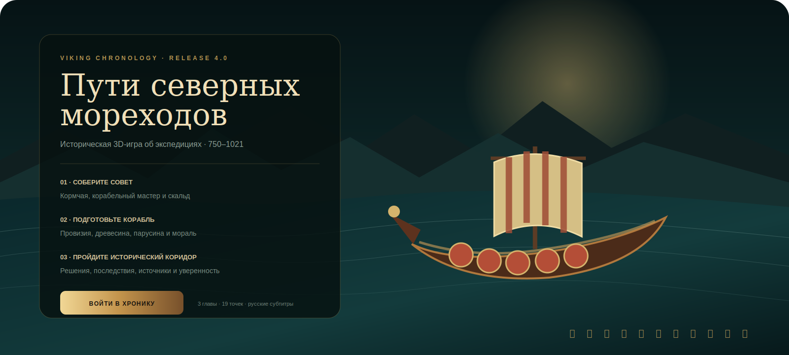
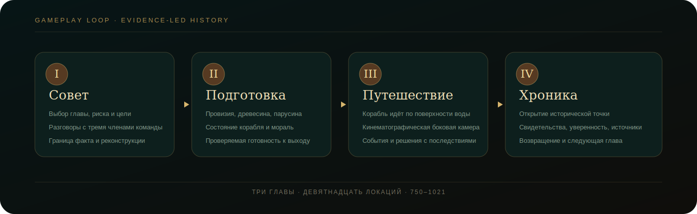
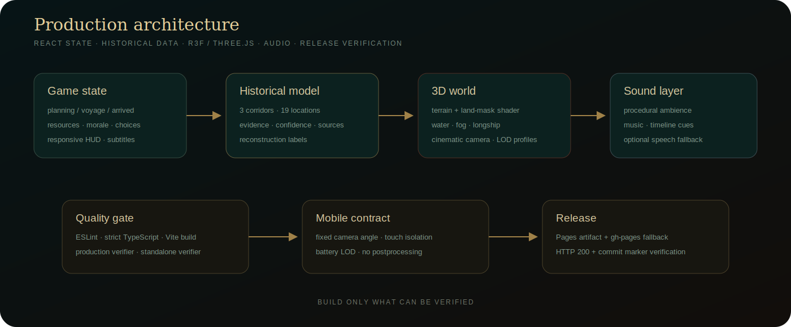

<p align="center">
  <a href="https://ivanchernykh.github.io/viking-chronology/">
    
  </a>
</p>

<p align="center">
  <a href="https://ivanchernykh.github.io/viking-chronology/">
    
  </a>
</p>

<p align="center">
<a href="https://github.com/IvanChernykh/viking-chronology/actions/workflows/ci.yml"></a>
<a href="https://github.com/IvanChernykh/viking-chronology/actions/workflows/pages.yml"></a>
<a href="#запуск"></a>
</p>

<p align="center">


</p>

<h1 align="center">Viking Chronology</h1>
<p align="center"><strong>Историческая 3D-игра-хронология о северных экспедициях · 750–1021</strong></p>
<p align="center">Фьорд, совет команды, подготовка корабля, кинематографическое путешествие, исторические решения, русские субтитры и проверяемые источники.</p>

<p align="center">
  <a href="https://ivanchernykh.github.io/viking-chronology/"><strong>Live</strong></a> ·
  <a href="#игровой-цикл">Gameplay</a> ·
  <a href="#историческая-дисциплина">Историчность</a> ·
  <a href="#mobile">Mobile</a> ·
  <a href="#архитектура">Архитектура</a> ·
  <a href="#запуск">Разработка</a>
</p>

> [!TIP]
> **Публичный релиз проверен автоматически.** Workflow получил HTTP 200 и подтвердил SHA опубликованной сборки через `version.txt`. Ссылка выше ведёт на реально развёрнутую версию, а не на предполагаемый адрес.

<table><tr>
<td align="center" width="20%"><strong>3</strong><br/><sub>экспедиционные главы</sub></td>
<td align="center" width="20%"><strong>19</strong><br/><sub>исторических локаций</sub></td>
<td align="center" width="20%"><strong>3</strong><br/><sub>члена команды</sub></td>
<td align="center" width="20%"><strong>750–1021</strong><br/><sub>хронология</sub></td>
<td align="center" width="20%"><strong>3</strong><br/><sub>GPU-профиля</sub></td>
</tr></table>

## Экспедиционная хроника, а не глобусная демонстрация

Игровой цикл: **собрать совет → подготовить экспедицию → пройти маршрут → принять решения → открыть исторический результат**. Мир — физическая плоская 3D-сцена с низкой боковой камерой. Longship движется у поверхности воды; территория раскрывается вместе с хронологией.

<table><tr><td width="50%" valign="top">

### Мир

- displaced terrain на основе открытых геоданных;
- анимированный океан и береговая зона;
- постепенное раскрытие неизвестных территорий;
- поселения, леса, горы и исторические маркеры.

</td><td width="50%" valign="top">

### Экспедиция

- совет с тремя членами команды;
- провизия, древесина, парусина и мораль;
- события с решениями и последствиями;
- автоматическая voyage camera и финальная хроника.

</td></tr></table>

## Игровой цикл

<p align="center"></p>

| Система | Реализация |
|---|---|
| **Совет** | три персонажа, диалоги, реконструированные древнескандинавские реплики и русские субтитры |
| **Подготовка** | провизия, древесина, парусина, мораль и условия готовности |
| **Путешествие** | `CatmullRomCurve3`, longship у воды, voyage camera, fog-of-war |
| **События** | выборы с последствиями для ресурсов и морали |
| **Хроника** | датировка, свидетельства, уверенность и институциональные источники |

## Три главы

| Глава | Период | Коридор | Риск |
|---|---:|---|---|
| **Западный берег** | 793–866 | Скандинавия → Британские острова | высокий |
| **Речной путь** | 860–907 | Балтика → Восточная Европа | умеренный |
| **Северная Атлантика** | 874–1021 | Исландия → Гренландия → западный горизонт | крайний |

Главы объединяют многолетние документированные процессы и не изображаются как маршрут одной исторической команды.

## Визуальная система

<table><tr><td width="50%" valign="top">

### Terrain и атмосфера

- land-mask из открытых данных `world-atlas`;
- displaced terrain, побережья и высотные зоны;
- water shader, волны и атмосферная перспектива;
- ACES tone mapping, bloom и vignette на desktop.

</td><td width="50%" valign="top">

### Longship и поселение

- корпус, палуба, щиты, вёсла и анимированный парус;
- движение непосредственно над поверхностью воды;
- длинный дом, мастерская, причал и костёр;
- отдельные mobile LOD и battery render path.

</td></tr></table>

## Историческая дисциплина

Маршруты — **многолетние исторические коридоры**, а не выдуманные GPS-треки. Каждая точка содержит датировку, географию, контекст, основание реконструкции, уровень уверенности и источники. Browser TTS используется только как фонетический fallback и не объявляется записью речи IX века.

Подробно: [`docs/HISTORICAL-METHODOLOGY.md`](docs/HISTORICAL-METHODOLOGY.md)

## Mobile

- один палец — pan без вращения;
- два пальца — dolly + pan;
- отдельная автоматическая камера во время плавания;
- независимая прокрутка карточек и iPhone safe-area;
- сниженные DPR, LOD, тени и плотность декора;
- восстановление после `webglcontextlost`.

## Архитектура

<p align="center"></p>

```text
React state → historical model → R3F / Three.js world → audio layer
     ↓               ↓                    ↓                 ↓
resources       evidence           terrain/water       ambience
choices         confidence         camera/longship     timeline cues
subtitles       sources            LOD/mobile          voice fallback
```

## Quality gate и Pages

`npm run check` выполняет ESLint, strict TypeScript, production build, asset/path verifier, standalone classic-IIFE build и compatibility verifier.

`Pages Release` создаёт `404.html`, `.nojekyll` и `version.txt`, загружает официальный artifact, публикует резервную `gh-pages`, выполняет deployment, проверяет публичный HTTP 200 с совпадением SHA и публикует машинно-читаемый отчёт в `pages-status`.

## Запуск

```bash
git clone https://github.com/IvanChernykh/viking-chronology.git
cd viking-chronology
npm install
npm run dev
```

Production gate: `npm run check`. Standalone: `npm run standalone`.

[Architecture](docs/ARCHITECTURE.md) · [Methodology](docs/HISTORICAL-METHODOLOGY.md) · [Mobile](docs/MOBILE-COMPATIBILITY.md) · [Performance](docs/PERFORMANCE.md) · [Release](docs/RELEASE.md)

---
<p align="center"><strong>Build only what can be verified.</strong><br/><sub>Хронология, путешествие, решения и источники — без фэнтезийной подмены истории.</sub></p>
