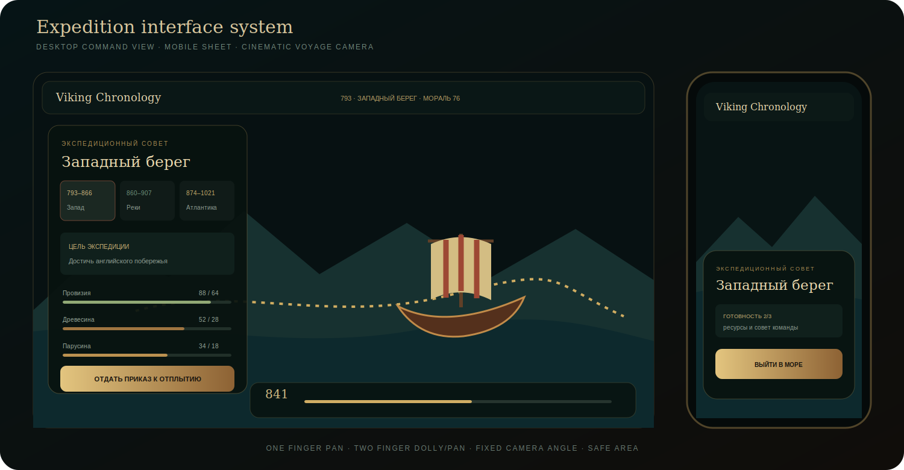

<p align="center">
  <a href="https://ivanchernykh.github.io/viking-chronology/">
    
  </a>
</p>

<p align="center">
  <a href="https://ivanchernykh.github.io/viking-chronology/">
    
  </a>
</p>

<p align="center">
  <a href="https://github.com/IvanChernykh/viking-chronology/actions/workflows/ci.yml"></a>
  <a href="https://github.com/IvanChernykh/viking-chronology/actions/workflows/pages.yml"></a>
  <a href="#разработка"></a>
</p>

<p align="center">
  
  
  
  
  
  
  
</p>

<h1 align="center">Viking Chronology</h1>
<p align="center"><strong>Историческая 3D-игра-хронология о северных экспедициях · 750–1021</strong></p>
<p align="center">
  Фьорд, совет команды, подготовка корабля, кинематографическое путешествие,
  решения с последствиями, русские субтитры и проверяемые исторические источники.
</p>

<p align="center">
  <a href="https://ivanchernykh.github.io/viking-chronology/"><strong>Live</strong></a> ·
  <a href="#игровой-цикл">Gameplay</a> ·
  <a href="#три-экспедиционные-главы">Главы</a> ·
  <a href="#мир-и-графическая-система">Графика</a> ·
  <a href="#историческая-дисциплина">Историчность</a> ·
  <a href="#мобильная-версия">Mobile</a> ·
  <a href="#архитектура">Архитектура</a> ·
  <a href="#разработка">Разработка</a>
</p>

> [!TIP]
> **Публичный релиз проверен автоматически.** Workflow получил HTTP 200 и подтвердил SHA опубликованной сборки через `version.txt`. Последний машинный отчёт: `build=success`, `enablePages=success`, `deploy=success`, `verify=success`.

---

<table>
<tr>
<td align="center" width="20%"><strong>3</strong><br/><sub>экспедиционные главы</sub></td>
<td align="center" width="20%"><strong>19</strong><br/><sub>исторических локаций</sub></td>
<td align="center" width="20%"><strong>3</strong><br/><sub>члена команды</sub></td>
<td align="center" width="20%"><strong>750–1021</strong><br/><sub>хронология</sub></td>
<td align="center" width="20%"><strong>3</strong><br/><sub>GPU-профиля</sub></td>
</tr>
</table>

## Не глобусная демонстрация. Экспедиционная хроника.

Viking Chronology построен вокруг законченного цикла: **собрать совет → подготовить экспедицию → пройти маршрут → принять решения → открыть исторический результат**.

Мир представлен как плоская физическая 3D-сцена с низкой боковой камерой. Longship движется у поверхности воды, неизвестные территории раскрываются вместе с хронологией, а события влияют на провизию, материалы и мораль команды.

<p align="center">
  
</p>

<p align="center"><sub>Design-system preview: desktop command view, mobile sheet и voyage camera. Схема честно показывает компоновку и не выдаётся за фотографию WebGL-рендера.</sub></p>

<table>
<tr>
<td width="50%" valign="top">

### Desktop command view

- постоянный expedition HUD;
- низкая боковая камера;
- маршрут у поверхности воды;
- хронология и состояние команды в одном кадре;
- автоматическое сопровождение судна во время путешествия.

</td>
<td width="50%" valign="top">

### Mobile expedition sheet

- отдельная полноэкранная панель управления;
- крупные touch-targets;
- независимая вертикальная прокрутка;
- iPhone safe-area;
- облегчённый battery render path.

</td>
</tr>
</table>

## Игровой цикл

<p align="center">
  
</p>

<table>
<tr>
<td width="25%" valign="top">

### I · Совет

- выбор исторической главы;
- цель и риск экспедиции;
- разговоры с кормчей, мастером и скальдом;
- явная граница между фактом и реконструкцией.

</td>
<td width="25%" valign="top">

### II · Подготовка

- провизия, древесина и парусина;
- готовность корабля;
- мораль команды;
- обязательный совет минимум с двумя персонажами.

</td>
<td width="25%" valign="top">

### III · Путешествие

- longship на поверхности воды;
- боковая кинематографическая камера;
- fog-of-war;
- события и решения с последствиями.

</td>
<td width="25%" valign="top">

### IV · Хроника

- открытие исторической точки;
- свидетельства и уровень уверенности;
- институциональные источники;
- возвращение и выбор следующей главы.

</td>
</tr>
</table>

## Три экспедиционные главы

| Глава | Период | Исторический коридор | Риск |
|---|---:|---|---|
| **Западный берег** | 793–866 | Скандинавия → Британские острова | высокий |
| **Речной путь** | 860–907 | Балтика → речные системы Восточной Европы | умеренный |
| **Северная Атлантика** | 874–1021 | Исландия → Гренландия → западный горизонт | крайний |

Главы объединяют многолетние документированные процессы и не изображаются как дословный маршрут одной исторической команды.

## Мир и графическая система

<table>
<tr>
<td width="50%" valign="top">

### Рельеф

- land-mask из открытых данных `world-atlas`;
- displaced terrain вместо текстурированной карточки;
- локальный микрорельеф и береговая зона;
- леса, скалы, поселения и реквизит;
- раскрытие территорий по времени и прогрессу.

</td>
<td width="50%" valign="top">

### Море и атмосфера

- отдельный animated water shader;
- волны, мелководье и береговая пена;
- хронологический fog-of-war;
- ACES filmic tone mapping;
- desktop bloom/vignette и облегчённый mobile render path.

</td>
</tr>
<tr>
<td width="50%" valign="top">

### Longship

- корпус, палуба, щиты и вёсла;
- анимированный парус;
- `CatmullRomCurve3` у поверхности воды;
- ориентация по касательной маршрута;
- ограниченная качка без полёта над картой.

</td>
<td width="50%" valign="top">

### Поселение и персонажи

- стартовый фьорд Хавнфьорд;
- длинный дом, мастерская, причал и костёр;
- Рагнхильд, Кетиль и Аса;
- отдельные силуэты и idle-анимация;
- древнескандинавская строка и русский перевод.

</td>
</tr>
</table>

## Историческая дисциплина

Маршруты представлены как **многолетние исторические коридоры**, а не как выдуманные GPS-треки. Каждая локация содержит:

1. датировку и современную географию;
2. исторический контекст;
3. основание реконструкции;
4. уровень уверенности;
5. проверяемые источники.

Реплики используют нормализованную древнескандинавскую орфографию, но являются специально написанными реконструкциями. Browser TTS используется только как фонетический fallback и не объявляется записью речи IX века.

Подробно: [`docs/HISTORICAL-METHODOLOGY.md`](docs/HISTORICAL-METHODOLOGY.md)

## Мобильная версия

Камера не работает как свободный 3D-viewer. Её угол ограничен, а жесты разделены между миром и интерфейсом.

| Жест | Действие |
|---|---|
| один палец | перемещение мира без вращения |
| два пальца | масштабирование и pan |
| касание персонажа или точки | выбор без конфликта с камерой |
| запуск главы | переход в voyage camera |
| завершение пути | фокус на финальной исторической точке |

Дополнительно:

- `touch-action: none` и `overscroll-behavior: none` на Canvas;
- собственный `pan-y` у карточек и диалогов;
- safe-area для iPhone;
- сниженные DPR, LOD, тени и плотность декора;
- post-processing отключается в battery-профиле;
- Error Boundary и восстановление после `webglcontextlost`.

Матрица: [`docs/MOBILE-COMPATIBILITY.md`](docs/MOBILE-COMPATIBILITY.md)

## Архитектура

<p align="center">
  
</p>

```text
src/
├── components/
│   ├── ExpeditionHUD.tsx      # главы, ресурсы, мораль и readiness
│   ├── EncounterPanel.tsx     # решения и последствия в пути
│   ├── VikingScene.tsx        # WebGL, камера, свет, quality guard
│   ├── MapSurface.tsx         # terrain и water shader
│   ├── ExplorationFog.tsx     # хронологический fog-of-war
│   ├── GroundRoute.tsx        # маршрут и движение корабля
│   ├── LongshipModel.tsx      # longship и парус
│   ├── VikingCamp.tsx         # поселение и интерактивные объекты
│   ├── VikingActor.tsx        # персонажи и hit areas
│   └── DialoguePanel.tsx      # реплика, перевод и voice fallback
├── data/
│   ├── expeditions.ts         # главы, требования и события
│   ├── routes.ts              # локации, даты и источники
│   └── dialogues.ts           # реконструированные диалоги
├── lib/
│   ├── voyagePath.ts          # путь и контроль высоты
│   ├── flatMap.ts             # проекция и land mask
│   ├── audioEngine.ts         # procedural music и ambience
│   └── deviceProfile.ts       # high / balanced / battery
└── styles/                    # responsive HUD и mobile sheets
```

Полное описание: [`docs/ARCHITECTURE.md`](docs/ARCHITECTURE.md)

## Quality gate

`npm run check` выполняет:

```text
ESLint
strict TypeScript
production Vite build
production asset/path verifier
standalone classic-IIFE build
standalone compatibility verifier
```

| Слой | Gzip |
|---|---:|
| CSS | ~10.2 KB |
| игровой UI | ~21.7 KB |
| VikingScene | ~11.9 KB |
| React vendor | ~61.5 KB |
| Three.js / R3F | ~332.6 KB |

## Проверяемый Pages release

`.github/workflows/pages.yml`:

1. запускает полный quality gate;
2. создаёт `404.html`, `.nojekyll` и `version.txt`;
3. загружает официальный Pages artifact;
4. публикует резервную ветку `gh-pages`;
5. проверяет/активирует Pages через GitHub API;
6. выполняет deployment в окружение `github-pages`;
7. проверяет публичный HTTP 200 и точный SHA;
8. публикует машинный отчёт в ветку `pages-status`.

Последний release report:

```json
{
  "sha": "abe2b2b191e11c4bd05be6d24594db5a8e424574",
  "build": "success",
  "enablePages": "success",
  "deploy": "success",
  "verify": "success"
}
```

## Разработка

Требования: **Node.js 22+**.

```bash
git clone https://github.com/IvanChernykh/viking-chronology.git
cd viking-chronology
npm install
npm run dev
```

Production:

```bash
npm run build
npm run preview
```

Полная проверка:

```bash
npm run check
```

Standalone:

```bash
npm run standalone
```

## Документация

[Architecture](docs/ARCHITECTURE.md) · [Historical methodology](docs/HISTORICAL-METHODOLOGY.md) · [Mobile compatibility](docs/MOBILE-COMPATIBILITY.md) · [Performance](docs/PERFORMANCE.md) · [Release notes](docs/RELEASE.md) · [Security](SECURITY.md)

## License

Код распространяется по лицензии [MIT](LICENSE). Исторические источники и внешние материалы принадлежат соответствующим правообладателям.

---

<p align="center">
  <a href="https://ivanchernykh.github.io/viking-chronology/"><strong>Открыть Viking Chronology</strong></a><br/><br/>
  <strong>Build only what can be verified.</strong><br/>
  <sub>Хронология, путешествие, решения и источники — без фэнтезийной подмены истории.</sub>
</p>
