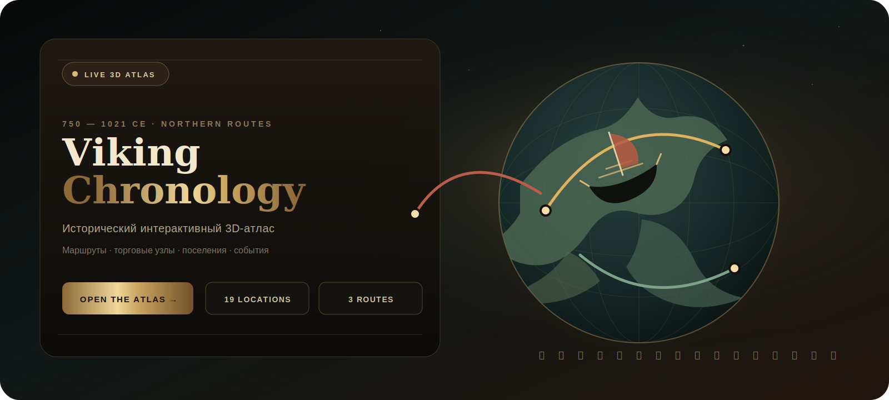
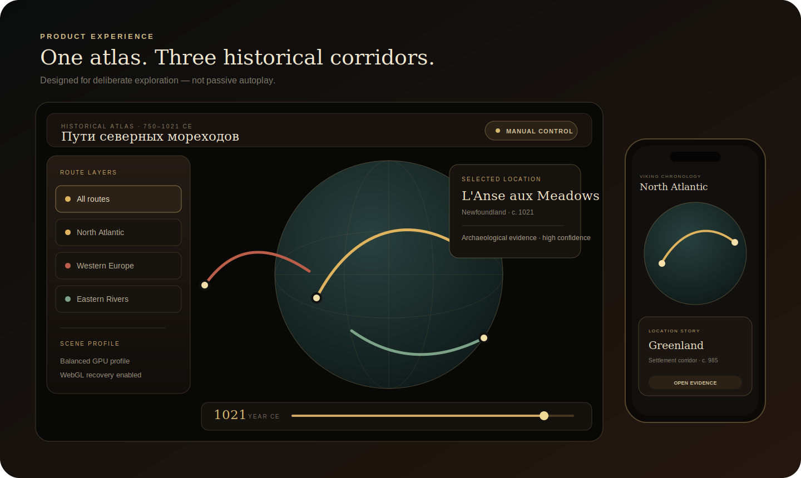

<p align="center">
  
</p>

<p align="center">
  <a href="https://ivanchernykh.github.io/viking-chronology/">
    
  </a>
  <a href="https://github.com/IvanChernykh/viking-chronology/actions/workflows/ci.yml">
    
  </a>
  <a href="https://github.com/IvanChernykh/viking-chronology/actions/workflows/pages.yml">
    
  </a>
  
  
  
</p>

<h1 align="center">Viking Chronology</h1>
<p align="center"><strong>Пути северных мореходов · VIII–XI века</strong></p>
<p align="center">
  Исторический интерактивный 3D-атлас маршрутов, торговых узлов, поселений и ключевых событий эпохи викингов.
</p>

<p align="center">
  <a href="https://ivanchernykh.github.io/viking-chronology/"><strong>Запустить проект</strong></a>
  ·
  <a href="#историческая-методология">Методология</a>
  ·
  <a href="#архитектура">Архитектура</a>
  ·
  <a href="#мобильная-версия">Mobile</a>
  ·
  <a href="#разработка">Разработка</a>
</p>

> [!IMPORTANT]
> На телефоне запускайте проект через **GitHub Pages**. Встроенные просмотрщики GitHub, Telegram, ChatGPT и iOS Files могут блокировать JavaScript, WebGL и Web Audio при открытии локального HTML-файла.

<p align="center">
  
</p>

## Проект в одном абзаце

**Viking Chronology** объединяет Three.js, React Three Fiber, TypeScript и Web Audio API в одном полноэкранном историческом опыте. Пользователь исследует глобус, выбирает доказательные маршрутные коридоры, открывает карточки остановок, перемещается по хронологии 750–1021 годов и слышит процедурно синтезированную звуковую среду — без фэнтезийной стилизации и без выдачи реконструкции за подлинную запись прошлого.

## Ключевые возможности

<table>
<tr>
<td width="50%" valign="top">

### Исторический атлас

- 3 крупных направления движения;
- 19 интерактивных остановок;
- датировка, современная география и тип события;
- доказательная база и уровень уверенности;
- прямые ссылки на институциональные источники.

</td>
<td width="50%" valign="top">

### 3D-визуализация

- процедурный глобус и атмосфера;
- дуги многолетних маршрутов;
- детализированные модели кораблей;
- плавная камера и ручная навигация;
- **автовращение полностью отсутствует**.

</td>
</tr>
<tr>
<td width="50%" valign="top">

### Взаимодействие

- увеличенные области попадания маркеров;
- надёжный tap/click на мобильных устройствах;
- карточка не закрывается случайным кликом по сцене;
- навигация между соседними точками;
- крупные touch-targets и safe-area.

</td>
<td width="50%" valign="top">

### Звуковая реконструкция

- море, ветер, река, дерево и вёсла;
- дальний рог, дрон и щипковые тембры;
- отдельные миксы по типу локации;
- независимая громкость среды и музыки;
- запуск только после действия пользователя.

</td>
</tr>
</table>

## Что было исправлено

### V4 — маркеры и ручная навигация

- удалено автовращение глобуса из состояния, UI и `OrbitControls`;
- область raycast каждой точки увеличена невидимой геометрией;
- выбор обрабатывается через `pointerdown`/`pointerup` с сенсорным допуском;
- маркер блокирует конфликт жеста с камерой;
- карточка истории закрывается только явно — кнопкой или `Escape`;
- размеры DOM-меток и визуальных маркеров увеличены.

### V3 — мобильная стабильность и плавность

- JavaScript target снижен до **ES2018**;
- standalone собирается как классический IIFE без `type="module"`;
- добавлены WebGL fallback, Error Boundary и context-loss recovery;
- Three.js загружается после первичного интерфейса;
- убраны постоянные изменения DPR;
- корабли движутся по `CatmullRomCurve3`;
- ориентация рассчитывается по касательной и нормали глобуса;
- quaternion-повороты сглаживаются через `slerp`;
- переход конца маршрута скрыт fade/scale envelope.

## Мобильная версия

| Область | Реализация |
|---|---|
| Совместимость | ES2018, Safari fallback API, WebGL diagnostics |
| Layout | Portrait, landscape, safe-area, нижняя карточка |
| Touch | Увеличенные hit-targets, допуск движения пальца |
| GPU | Профили `high`, `balanced`, `battery` |
| Надёжность | Context recovery и управляемое снижение качества |
| Доступность | `prefers-reduced-motion`, контрастность, ARIA-labels |

Подробная матрица: [`docs/MOBILE-COMPATIBILITY.md`](docs/MOBILE-COMPATIBILITY.md).

## Производительность

Проект использует стабильный, а не постоянно изменяющийся DPR. Уровень качества выбирается по профилю устройства и может понизиться только после устойчиво низкого FPS.

Основные меры:

- 3D-сцена отделена от частоты React-обновлений;
- хронология ограничена примерно 20 обновлениями/сек. на desktop и 11 на mobile;
- геометрия, звёзды, освещение и текстуры масштабируются по профилю;
- тяжёлые визуальные фильтры отключаются на слабых устройствах;
- маршруты и картографические данные мемоизируются;
- production bundle разделён на React, Three.js и геоданные.

Подробности: [`docs/PERFORMANCE.md`](docs/PERFORMANCE.md).

## Историческая методология

Маршруты представлены как **многолетние исторические коридоры**, а не GPS-трек одной флотилии. Каждая остановка содержит:

1. датировку и современную географию;
2. краткое историческое описание;
3. основание реконструкции;
4. уровень уверенности;
5. проверяемые источники.

Используются материалы National Museum of Denmark, UNESCO, English Heritage и других институциональных источников. Спорные положения маркируются отдельно.

> [!NOTE]
> Подлинных аудиозаписей эпохи викингов не существует. Звуковой слой является исследовательской реконструкцией природной среды, материалов судна и вероятных инструментальных тембров.

Полный документ: [`docs/HISTORICAL-METHODOLOGY.md`](docs/HISTORICAL-METHODOLOGY.md).

## Архитектура

```text
src/
├── components/
│   ├── VikingScene.tsx       # Canvas, камера, GPU-профили, context recovery
│   ├── Globe.tsx             # глобус и картографическая текстура
│   ├── RouteArc.tsx          # дуги маршрутов
│   ├── MovingShip.tsx        # интерполяция и плавная ориентация корабля
│   ├── StopMarker.tsx        # увеличенные интерактивные исторические точки
│   ├── StoryPanel.tsx        # история, доказательства и источники
│   ├── Timeline.tsx          # временная шкала
│   └── SceneFallback.tsx     # управляемый отказ WebGL
├── data/routes.ts            # исторический набор данных
├── hooks/                    # media query и аудиоуправление
├── lib/                      # геометрия, device profile, audio, texture pipeline
└── styles/                   # слоистая адаптивная дизайн-система
```

Расширенное описание: [`docs/ARCHITECTURE.md`](docs/ARCHITECTURE.md).

## Технологический стек

<p>
  
  
  
  
  
  
</p>

## Разработка

Требования: **Node.js 22+**.

```bash
git clone https://github.com/IvanChernykh/viking-chronology.git
cd viking-chronology
npm install
npm run dev
```

Production-сборка:

```bash
npm run build
npm run preview
```

Полная проверка:

```bash
npm run check
```

Команда запускает ESLint, строгий TypeScript, production build, standalone build и compatibility verifier.

## Автономный HTML

```bash
npm run standalone
```

Результат: `viking-chronology-standalone.html`.

Этот файл предназначен для архива и локальной демонстрации. Для стабильного запуска на телефоне используйте HTTPS-версию GitHub Pages.

## GitHub Pages

Публикация выполняется workflow-файлом `.github/workflows/pages.yml` после push в `main`.

Публичный адрес:

**https://ivanchernykh.github.io/viking-chronology/**

При первом развёртывании откройте **Settings → Pages** и установите источник **GitHub Actions**.

## Качество и сопровождение

- [Сообщить о дефекте](https://github.com/IvanChernykh/viking-chronology/issues/new/choose)
- [Правила участия](CONTRIBUTING.md)
- [Security policy](SECURITY.md)
- [Мобильная совместимость](docs/MOBILE-COMPATIBILITY.md)
- [Performance budget](docs/PERFORMANCE.md)

## Лицензия

Распространяется по лицензии [MIT](LICENSE). Материалы внешних институциональных источников принадлежат соответствующим правообладателям.

<p align="center">
  <sub>Создано как технически строгая и исторически дисциплинированная интерактивная реконструкция.</sub>
</p>
