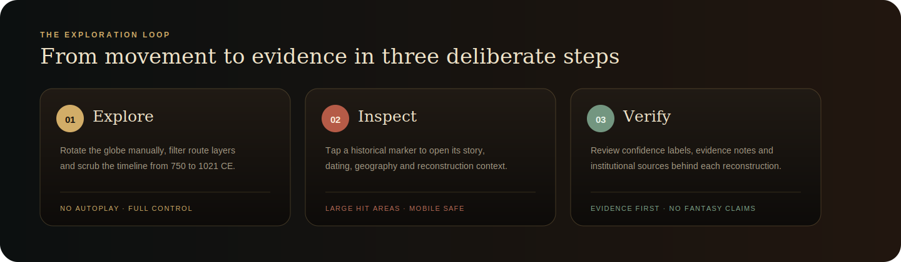
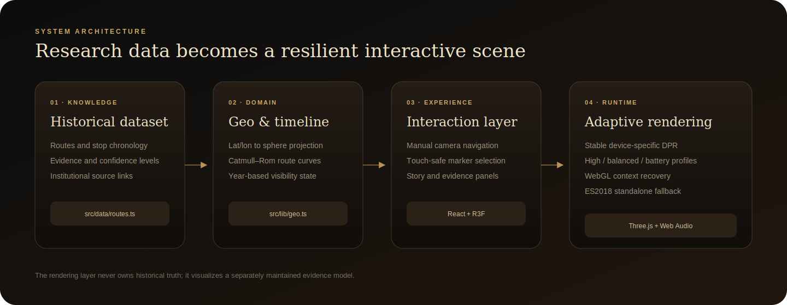

<p align="center">
  <a href="https://ivanchernykh.github.io/viking-chronology/">
    
  </a>
</p>

<p align="center">
  <a href="https://ivanchernykh.github.io/viking-chronology/">
    
  </a>
  <a href="https://github.com/IvanChernykh/viking-chronology/actions/workflows/ci.yml">
    
  </a>
  <a href="https://github.com/IvanChernykh/viking-chronology/actions/workflows/pages.yml">
    
  </a>
</p>

<p align="center">
  
  
  
  
  
  
</p>

<h1 align="center">Viking Chronology</h1>
<p align="center"><strong>Пути северных мореходов · VIII–XI века</strong></p>
<p align="center">
  Исследовательский интерактивный 3D-атлас маршрутов, торговых узлов, поселений и событий эпохи викингов.
</p>

<p align="center">
  <a href="https://ivanchernykh.github.io/viking-chronology/"><strong>Открыть атлас</strong></a>
  ·
  <a href="#исследовательский-опыт">Исследовать</a>
  ·
  <a href="#историческая-дисциплина">Методология</a>
  ·
  <a href="#архитектура">Архитектура</a>
  ·
  <a href="#локальный-запуск">Разработка</a>
</p>

> [!IMPORTANT]
> **GitHub Pages требует однократной активации владельцем репозитория.** Откройте [`Settings → Pages`](https://github.com/IvanChernykh/viking-chronology/settings/pages), в поле **Source** выберите **GitHub Actions**. После этого workflow автоматически соберёт и опубликует сайт по адресу `ivanchernykh.github.io/viking-chronology`.

---

<table>
<tr>
<td align="center" width="25%"><strong>750–1021</strong><br/><sub>хронологический диапазон</sub></td>
<td align="center" width="25%"><strong>3</strong><br/><sub>исторических коридора</sub></td>
<td align="center" width="25%"><strong>19</strong><br/><sub>интерактивных локаций</sub></td>
<td align="center" width="25%"><strong>3 GPU-профиля</strong><br/><sub>high · balanced · battery</sub></td>
</tr>
</table>

## Не статическая карта. Исторический инструмент исследования.

**Viking Chronology** соединяет исторический набор данных, пространственную визуализацию, хронологию и доказательную базу в одном полноэкранном интерфейсе. Пользователь не наблюдает за автоматической анимацией — он самостоятельно управляет глобусом, выбирает маршруты, открывает точки, сопоставляет даты и проверяет источники.

<p align="center">
  
</p>

<table>
<tr>
<td width="33%" valign="top">

### Ручное исследование

Глобус не вращается автоматически. Камера, масштаб, направление и временная позиция полностью контролируются пользователем.

</td>
<td width="33%" valign="top">

### Истории локаций

Каждая точка раскрывает датировку, современную географию, исторический контекст, основание реконструкции и уровень уверенности.

</td>
<td width="33%" valign="top">

### Проверяемость

Маршруты трактуются как многолетние коридоры, а не выдуманный GPS-трек одной экспедиции. Спорные утверждения маркируются явно.

</td>
</tr>
</table>

## Исследовательский опыт

<p align="center">
  
</p>

### Что происходит в интерфейсе

- **Explore:** ручное вращение глобуса, масштабирование, фильтрация маршрутов и перемещение по шкале 750–1021 годов.
- **Inspect:** tap/click по увеличенной интерактивной области маркера открывает информационную карточку без конфликта с жестом камеры.
- **Verify:** пользователь видит доказательства, степень уверенности и ссылки на институциональные источники.

## Три направления движения

<table>
<tr>
<td width="33%" valign="top">

### Северная Атлантика

Исландия, Гренландия и североамериканский археологический горизонт. Морские переходы, поселения и предел западного продвижения.

</td>
<td width="33%" valign="top">

### Западная Европа

Британские острова, Франкское побережье и зоны торговли, войны, колонизации и политической интеграции.

</td>
<td width="33%" valign="top">

### Восточные реки

Балтика, речные системы Восточной Европы и связи с Византией и исламским миром.

</td>
</tr>
</table>

## Визуальная и звуковая система

| Система | Реализация |
|---|---|
| Глобус | Процедурная текстура, атмосфера, маршруты и адаптивная геометрия |
| Корабли | `CatmullRomCurve3`, касательная маршрута, нормаль глобуса и quaternion `slerp` |
| Маркеры | Увеличенные невидимые hit-зоны, touch tolerance, независимый click/tap |
| Камера | Только ручное управление; автовращение отсутствует на уровне `OrbitControls` |
| Хронология | Отделена от частоты рендера Three.js и ограничена по частоте React-обновлений |
| Звук | Процедурная реконструкция моря, ветра, дерева, вёсел и инструментальных тембров |

> [!NOTE]
> Подлинных аудиозаписей эпохи викингов не существует. Звуковой слой — художественно-исследовательская реконструкция природной среды, материалов судна и вероятных тембров, а не заявление об исторической аутентичности записи.

## Mobile-first надёжность

<table>
<tr>
<td width="50%" valign="top">

### Совместимость

- production target **ES2018**;
- standalone в формате classic IIFE;
- fallback для старого Safari MediaQuery API;
- WebGL2 diagnostics;
- Error Boundary и восстановление `webglcontextlost`;
- safe-area для iPhone и адаптивный portrait layout.

</td>
<td width="50%" valign="top">

### Производительность

- стабильный DPR вместо постоянного изменения разрешения;
- профили `high`, `balanced`, `battery`;
- автоматическое однонаправленное снижение качества при устойчиво низком FPS;
- уменьшение сегментов, света, звёзд и текстур на слабых GPU;
- lazy-loading 3D-сцены после первичного UI.

</td>
</tr>
</table>

Подробности: [Mobile compatibility](docs/MOBILE-COMPATIBILITY.md) · [Performance budget](docs/PERFORMANCE.md)

## Историческая дисциплина

Проект отделяет **фактические данные**, **обоснованную реконструкцию** и **визуальное представление**.

Каждая локация содержит:

1. датировку или временной диапазон;
2. современную географическую привязку;
3. краткий исторический контекст;
4. основание реконструкции;
5. уровень уверенности;
6. проверяемые источники.

Используются материалы National Museum of Denmark, UNESCO, English Heritage и других институциональных источников. Полный подход описан в [`docs/HISTORICAL-METHODOLOGY.md`](docs/HISTORICAL-METHODOLOGY.md).

## Архитектура

<p align="center">
  
</p>

```text
src/
├── components/
│   ├── VikingScene.tsx       # Canvas, camera, device profile, context recovery
│   ├── Globe.tsx             # globe and procedural cartographic texture
│   ├── RouteArc.tsx          # historical route corridors
│   ├── MovingShip.tsx        # curve motion and quaternion orientation
│   ├── StopMarker.tsx        # touch-safe historical markers
│   ├── StoryPanel.tsx        # evidence, narrative and sources
│   └── Timeline.tsx          # chronology controls
├── data/routes.ts            # historical evidence model
├── hooks/                    # media query and audio controls
├── lib/                      # geo, device profile, audio and texture pipeline
└── styles/                   # layered responsive design system
```

Полное описание: [`docs/ARCHITECTURE.md`](docs/ARCHITECTURE.md)

## Исправления V4

- полностью удалено автовращение глобуса;
- увеличена raycast-область исторических маркеров;
- tap/click отделён от жеста вращения камеры;
- добавлен допустимый сдвиг пальца при нажатии;
- информационная карточка закрывается только явным действием;
- движение кораблей переведено на плавные кривые и quaternion-сглаживание;
- мобильная сборка и standalone совместимы с более широким диапазоном браузеров.

Release notes: [`docs/RELEASE.md`](docs/RELEASE.md)

## Локальный запуск

Требования: **Node.js 22+**.

```bash
git clone https://github.com/IvanChernykh/viking-chronology.git
cd viking-chronology
npm install
npm run dev
```

### Полная проверка

```bash
npm run check
```

Проверка включает ESLint, строгий TypeScript, production build, standalone build и mobile compatibility verifier.

### Production

```bash
npm run build
npm run preview
```

### Автономный HTML

```bash
npm run standalone
```

Результат: `viking-chronology-standalone.html`. Для телефона предпочтительна HTTPS-версия через GitHub Pages, поскольку встроенные просмотрщики файлов могут блокировать JavaScript, WebGL и Web Audio.

## GitHub Pages

Workflow `.github/workflows/pages.yml` автоматически:

1. устанавливает зависимости;
2. создаёт production build;
3. загружает Pages artifact;
4. публикует его в окружение `github-pages`.

Для первого запуска владелец репозитория должен один раз выбрать **GitHub Actions** в [`Settings → Pages`](https://github.com/IvanChernykh/viking-chronology/settings/pages). Это требование платформы GitHub, а не приложения.

## Документация

<table>
<tr>
<td width="50%">

- [Architecture](docs/ARCHITECTURE.md)
- [Historical methodology](docs/HISTORICAL-METHODOLOGY.md)
- [Mobile compatibility](docs/MOBILE-COMPATIBILITY.md)

</td>
<td width="50%">

- [Performance budget](docs/PERFORMANCE.md)
- [Release notes](docs/RELEASE.md)
- [Security policy](SECURITY.md)

</td>
</tr>
</table>

## Contribution

Дефекты и предложения принимаются через [GitHub Issues](https://github.com/IvanChernykh/viking-chronology/issues/new/choose). Перед изменениями ознакомьтесь с [`CONTRIBUTING.md`](CONTRIBUTING.md).

## License

Исходный код распространяется по лицензии [MIT](LICENSE). Материалы внешних институциональных источников принадлежат соответствующим правообладателям.

---

<p align="center">
  <strong>Built as an evidence-led historical interface.</strong><br/>
  <sub>Не фэнтезийная карта. Не автоматическая демонстрация. Инструмент пространственного исследования.</sub>
</p>
